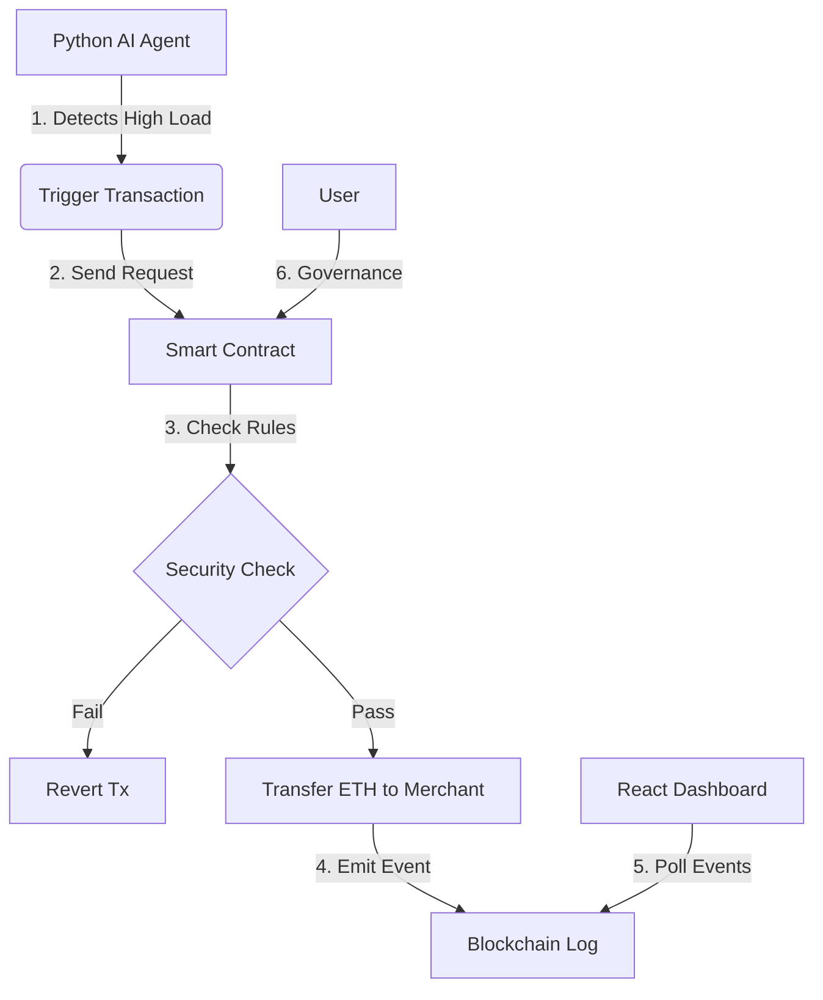

# Artha Rail ⚡ The Autonomous Governance Layer for AI Commerce


**Artha Rail** is a secure, restricted payment rail designed specifically for AI Agents. It acts as a "Bank Account for Robots," allowing autonomous agents to hold funds and transact on the Blockchain, but only within strict, programmable boundaries defined by a human owner.

## 🚀 The Problem
As AI agents become more autonomous, they need to pay for resources (APIs, compute, storage). However, giving an AI unrestricted access to a crypto wallet is dangerous.
* **Risk:** The AI could hallucinate and drain the wallet.
* **Risk:** The Agent could be hacked.

## 💡 The Solution: Artha Rail
We implement a **Hybrid Architecture**:
1.  **The Brain (Off-Chain):** A Python AI Agent monitors system resources and decides *when* to spend.
2.  **The Guard (On-Chain):** A Solidity Smart Contract enforces *how much* can be spent and *where* it can go.

---

## 🛠️ Tech Stack

### 1. Blockchain Layer (The Security)
* **Solidity (v0.8.20):** Custom Smart Contract deployed on Ethereum Sepolia.
* **Features:** Daily spending limits, Cooldown timers, Whitelisted Merchants, Emergency "Kill Switch" (Pause).

### 2. AI Agent Layer (The Automation)
* **Python:** Runs the autonomous logic.
* **Web3.py:** Connects the Python script to the Blockchain.
* **Logic:** Simulates system load scaling; triggers payments when load > 80%.

### 3. Frontend Dashboard (The Control Center)
* **React.js (Vite):** Fast, responsive UI.
* **Tailwind CSS:** Modern styling with glassmorphism effects.
* **Web3.js / Ethers.js:** Handles wallet connection and real-time event polling.
* **Features:** Live transaction feed, wallet disconnection, limit updates, and merchant management.

---

## 🏗️ Architecture



---

## ⚙️ Key Features

* **🛡️ Programmable Limits:** Set daily budgets (e.g., 0.1 ETH/day). The contract automatically resets the budget every 24 hours.
* **⏱️ Anti-Spam Cooldowns:** Forces a delay (e.g., 30s) between transactions to prevent runaway loops.
* **📋 Whitelist Only:** The agent can ONLY pay addresses approved by the human owner.
* **🛑 Emergency Stop:** A "Pause" button on the dashboard instantly freezes the contract in case of bugs.
* **📊 Real-Time Auditing:** Every action is logged on-chain and visualized instantly on the dashboard.

---

## 🚀 Setup & Installation

### Prerequisites

* Node.js & npm
* Python 3.x
* MetaMask Wallet (with Sepolia ETH)
* Alchemy/Infura API Key

### Step 1: Deploy Smart Contract

1. Open `AgenticCommerceOS.sol` in Remix IDE.
2. Compile and Deploy to **Injected Provider - MetaMask (Sepolia)**.
3. Copy the **Contract Address**.

### Step 2: Configure & Run AI Agent

1. Navigate to the python folder.
2. Install dependencies:
```bash
pip install web3

```


3. Update `main_agent.py` with your **Contract Address**, **Private Key**, and **Alchemy URL**.
4. Run the agent:
```bash
python3 main_agent.py

```


### Step 3: Run the Dashboard

1. Navigate to the frontend folder.
2. Install dependencies:
```bash
npm install

```


3. Update `AgenticDashboard.jsx` with your **Contract Address** and **Alchemy URL**.
4. Start the app:
```bash
npm run dev

```


---

## 📸 Usage Guide

1. **Connect Wallet:** Log in as the Owner/Admin.
2. **Fund the Agent:** Send ETH to the Contract Vault so the agent has funds to spend.
3. **Whitelist a Merchant:** Add a destination address (e.g., "AWS Server").
4. **Watch it Work:** As the Python script runs, you will see "Payment Executed" events appear live on the dashboard history.
5. **Emergency:** Click "Pause Agent" to lock the system immediately.

---

## 🔮 Future Roadmap (Version 2.0)

* **Chainlink Functions:** Move the Python logic to a decentralized Chainlink node for 100% uptime.
* **Multi-Agent Support:** Allow multiple agents with different budgets to use the same Treasury.
* **Stablecoin Support:** Upgrade contract to support USDC/USDT payments instead of just ETH.

---

## 📜 License

This project is licensed under the MIT License.

```
